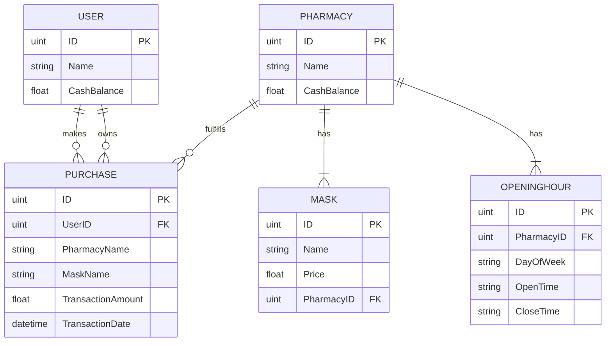

## ERD ##

```mermaid
erDiagram
    USER ||--o{ PURCHASE : makes
    USER ||--o{ PURCHASE : owns
    PHARMACY ||--|{ MASK : has
    PHARMACY ||--|{ OPENINGHOUR : has
    PHARMACY ||--o{ PURCHASE : fulfills

    USER {
        uint ID PK
        string Name
        float CashBalance
    }

    PHARMACY {
        uint ID PK
        string Name
        float CashBalance
    }

    MASK {
        uint ID PK
        string Name
        float Price
        uint PharmacyID FK
    }

    PURCHASE {
        uint ID PK
        uint UserID FK
        string PharmacyName
        string MaskName
        float TransactionAmount
        datetime TransactionDate
    }

    OPENINGHOUR {
        uint ID PK
        uint PharmacyID FK
        string DayOfWeek
        string OpenTime
        string CloseTime
    }
```